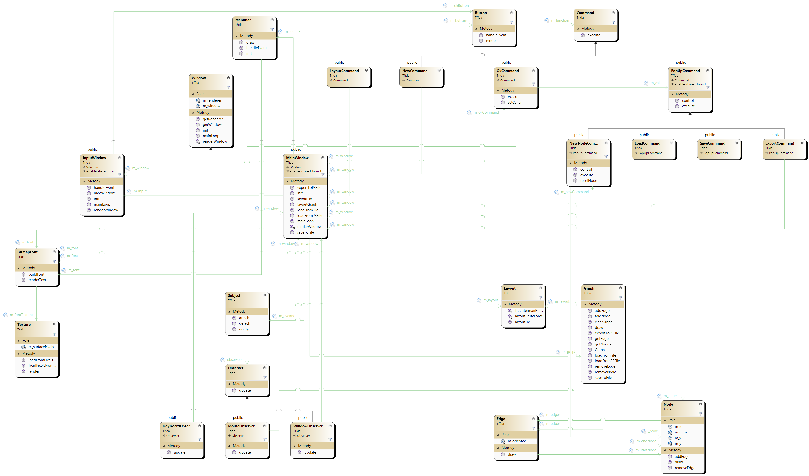
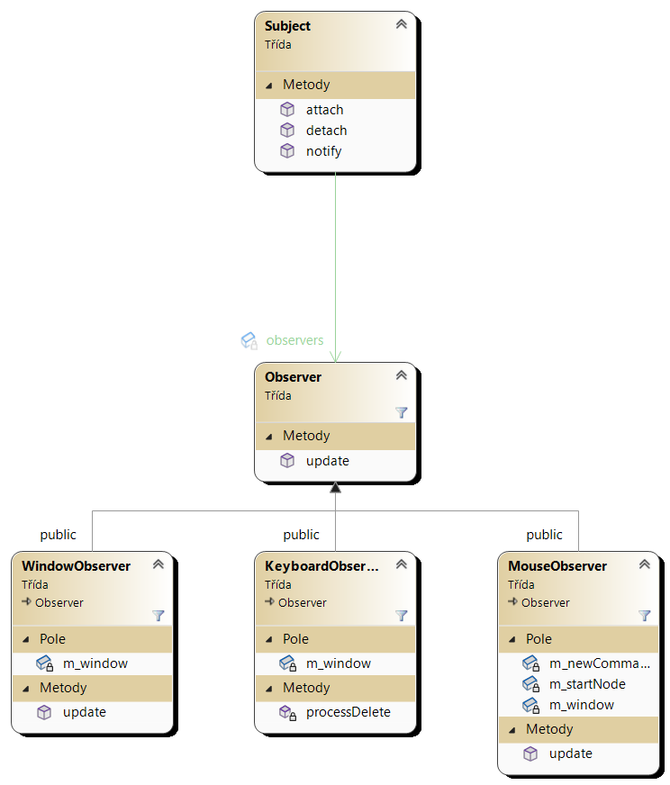
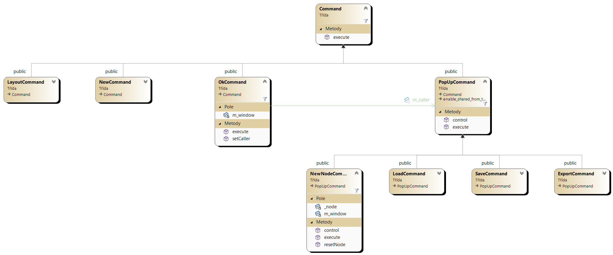

# Dokumentace Node Graph Editoru

## Popis
Graph Editor je program pro tvorbu a editaci grafů. Uživatelé mohou vytvářet nové grafy, přidávat uzly a hrany, upravovat jejich pozice a provádět další úpravy. Program také umožňuje exportovat graf do formátu PostScript.

## Návrh
Níže můžete vidět **class diagram** projektu:

### Struktura kódu
Kód programu Node Graph Editor je strukturován do několika pro funkčnost hlavních logických modulů:

* main_window.h a main_window.cpp - zajišťuje inicializaci SDL knihovny a běh hlavního okna (rozesílání událostí a vykreslování okna).
* graph.h, graph.cpp a graph_file_manager.cpp - definice a implementace třídy Graph, která reprezentuje graf v programu. Tato třída uchovává seznam uzlů a hran grafu a umožňuje přidávat nové uzly a hrany, upravovat pozici uzlů a exportovat graf do formátu PostScript.
* node.h a node.cpp - definice a implementace třídy Node, která reprezentuje uzel v grafu. Tato třída uchovává informace o pozici uzlu v grafu a umožňuje tyto informace upravovat.
* edge.h a edge.cpp - definice a implementace třídy Edge, která reprezentuje hranu v grafu. Tato třída uchovává informace o počátečním a koncovém uzlu hrany a umožňuje tyto informace upravovat.
* layout.h a layout.cpp - zajišťuje rozložení grafu na zadaném prostoru.
* events.h a events.cpp - stará se o zpracování všech událostí hlavního okna kromě hlavního menu.
* menu.h a menu.cpp - vykresluje a vytváří hlavní menu, přeposílá události jednotlivým tlačítkám v menu.

## Běh programu
Běh programu začí inicializací SDL knihovny a konstrukcí `MainWindow`. Po veškeré inicializaci se spustí fukce `mainLoop()`. V této funkci setrvává program celý běh programu, reaguje na události okna a vykresluje okno.

Při interakci uživatele s plochou okna se o zpracování události starají potomci třídy `Observer`. Při kliknutí na nějaké z tlačítek je zavoláná fuknce `execute()` potomka třídy `Command`, který je definován ve zvoleném tlačítku.

Možné akce tlačítek:
* New - reset třídy `Graph` vlastněné hlavním oknem
* Open - otevření nového okna (třída `InputWindow`) na zadání adresy a následné otevření grafu z vybraného souboru (přípony .txt nebo .ps)
* Save - uložení grafu v aktuálním stavu v definovém syntaxu do textového souboru, jež je zadán uživatelem v novém okně (třída `InputWindow`)
* Export - exportování grafu do PostScript souboru na adrese definované uživatelem v novém okně
* Layout - zarovnání grafu pomocí brute force algoritmu (počet hran v grafu je menší než 6) nebo pomocí Fruchterman-Reingold algoritmu

## Detaily editoru

## Použité knihovny
Program Graph Editor byl napsán v jazyce C++ s použitím knihovny SDL pro zobrazování a interakci s uživatelem.

## Použité algoritmy
Program Node Graph Editor používá algoritmus Fruchterman-Reingold pro automatické rozložení uzlů v grafu. 
### Fruchterman-Reingold algoritmus
Tento algoritmus simuluje pohyb uzlů v grafu podle vzájemného odpuzování a přitažlivosti a snaží se minimalizovat celkovou délku hran v grafu.
Tento algoritmus funguje následovně:
1. Inicializace pozic uzlů - všechny uzly jsou náhodně rozmístěny na ploše grafu.
2. Výpočet síly odpuzování - pro každý pár uzlů jsou vypočteny odpuzovací síly, které se snaží uzly od sebe vzdalovat. Odpuzovací síla mezi dvěma uzly se vypočítá podle vzorce F = k^2 / d, kde k je konstanta odpuzení a d je vzdálenost mezi uzly.
3. Výpočet síly přitažení - pro každou hranu jsou vypočteny přitažlivé síly, které se snaží uzly spojené hranou přitáhnout k sobě. Přitažlivá síla mezi dvěma uzly se vypočítá podle vzorce F = d^2 / k, kde k je konstanta přitažení a d je délka hrany.
4. Výpočet nových pozic uzlů - na základě vypočtených sil je pro každý uzel vypočtena nová pozice tak, aby se uzel snažil vypadat co nejlépe ve vztahu ke všem ostatním uzlům.
5. Opakování kroků 2-4, dokud nedojde k ustálení pozic uzlů nebo se neprovede stanovený počet iterací.

## Použité návrhové vzory
### Observer
Trochu upravený návrhový vzor Observer byl použit v hlavním okně na zachytávání a zpracování událostí okna.

### Command
Pro implementaci funkčnosti tlačítek byl využit návrhový vzor Command, jehož strukturu v projektu můžete vidět níže.

## Plány do budoucna
* [ ] Podpora dalších formátů exportu: Kromě formátu PostScript by mohla být implementována podpora pro další formáty, jako je například SVG nebo PNG.

* [ ] Implementace undo/redo: Uživatelé by mohli ocenit možnost vrátit se k předchozímu stavu grafu pomocí undo/redo funkce.

* [ ] Podpora klávesových zkratek: Pro zrychlení práce s programem by mohly být implementovány klávesové zkratky pro nejčastější akce, jako je například vytvoření nového uzlu či hran, smazání uzlu či hran, přesunutí uzlu atd.
