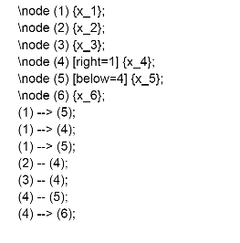
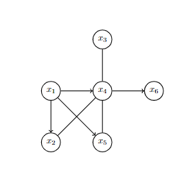

# Specifikace

## Vizualizace a editace grafů

Textový editor s vlastní syntaxí na definování a vykreslování (uzlových) grafů s možností úpravy vrcholů a hran (nastavení názvů vrcholu, orientace hran,...).
Program by se měl starat o prvotní rozložení grafu (za pomoci kombinace Pružinového algoritmu a algoritmu Fruchterman-Reingold) s možností následné úpravy vzhledu i rozložení grafu uživatelem.

Grafy jsou uložené pro práci v programu za pomoci seznamu vrcholů (s jejich umístěním) a hran. Po vytvoření grafu je možný export do PostScriptu.

### Ukázkové vstupy a výstupy

Vstup:

Výstup:

_vykreslení grafu v programu a možnost expostu do PostScriptu_

### Externí knihovny
- SDL - grafické rozhraní
- GNU Readline - práce s uživatelským vstupem
- LibHaru a Aspose - tvorba PDF nebo PNG souborů

### Případná rozšíření
- možné přidání ruční úpravu vrcholů uživatelem pomocí GUI
- export grafů do pdf nebo jpg formátu
